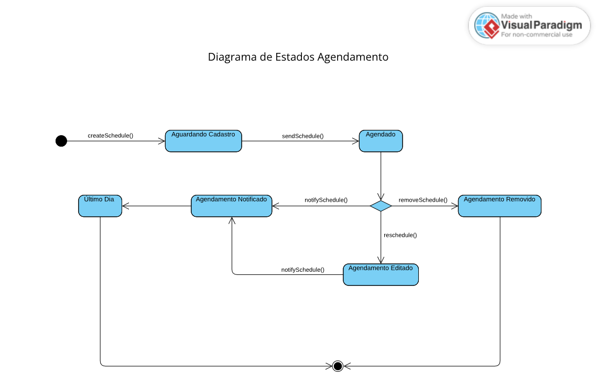
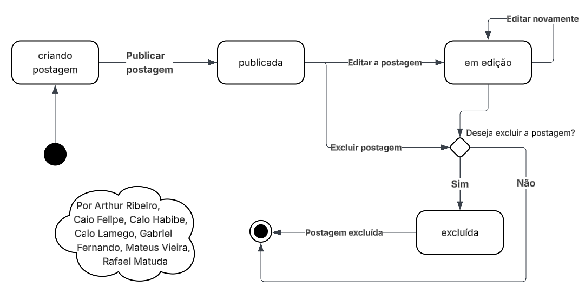

# Diagrama de Estados

## Introdução

Uma máquina de estados é um dispositivo que armazena o status de um objeto em um determinado momento e pode mudar de status ou causar outras ações baseado na entrada que recebe. Na modelagem UML, um diagrama de estados especifica o comportamento de objetos individuais em resposta e eventos. Esse diagrama é composto por elementos como estados, transições, eventos, ações e condições.

O diagrama de estados é útil para modelar sistemas orientados a eventos por conta do seu comportamento dinâmico que representa com clareza comportamentos complexos e dependentes de ações. Essa abordagem pode ser aplicada durante todas as fases de um projeto de software, desde o levantamento de requisitos até a implementação.

## Rascunhos

Para alcançar o Diagrama de Estados final nos dedicamos um tempo para fazer rascunhos individuais do mesmo, como um tipo de estudo e inicialização do processo:

Davi Casseb

## Diagrama UML de Estados

Descrição: O Diagrama de Estados do Plante Vc Mesmo! foi dividido entre os quatro principais elementos, sendo eles: Registro de Plantas, Login/Autenticação, LLM e o estado das Postagens. Com isso, obtendo o fluxo de estados destes elementos, fica claro o comportamento essencial do sistema.

### Diagrama de Estados - Registro de Plantas

### Diagrama de Estados - Login

### Diagrama de Estados - LLM

### Diagrama de Estados - Postagens

## Histórico de Versão

| Versão | Data       | Alterações Principais                             | Autor(es)        |
|--------|------------|---------------------------------------------------|:----------------:|
| 1.0.0  | 06-05-2025 | Adição de fundamentação teórica                | Arthur Ribeiro, Mateus Vieira, Caio Felipe   Caio Habibe, Caio Lamego, Gabriel Fernando   Rafael Matuda   |
| 1.0.1  | 06-05-2025 | Adição dos diagramas finais | Caio Lamego, Gabriel Fernando   Rafael Matuda, Matheus Brant   |
| 1.0.2  | 06-05-2025 | Adição dos rascunho | Arthur Ribeiro, Mateus Vieira, Caio Felipe   Caio Habibe, Caio Lamego, Gabriel Fernando   Rafael Matuda, Matheus Brant |