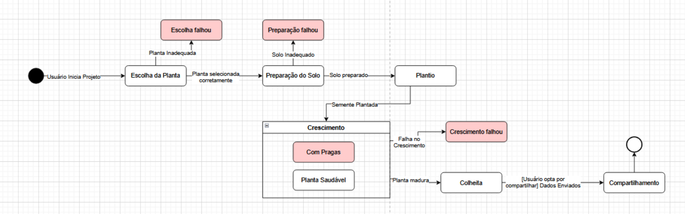

# Diagrama de Estados

## Introdução

Uma máquina de estados é um dispositivo que armazena o status de um objeto em um determinado momento e pode mudar de status ou causar outras ações baseado na entrada que recebe. Na modelagem UML, um diagrama de estados especifica o comportamento de objetos individuais em resposta e eventos. Esse diagrama é composto por elementos como estados, transições, eventos, ações e condições.

O diagrama de estados é útil para modelar sistemas orientados a eventos por conta do seu comportamento dinâmico que representa com clareza comportamentos complexos e dependentes de ações. Essa abordagem pode ser aplicada durante todas as fases de um projeto de software, desde o levantamento de requisitos até a implementação.

## Rascunhos

Para alcançar a realização do Diagrama de Estados, nos dedicamos um tempo para fazer rascunhos individuais do mesmo (Figuras 1 a 4), como um tipo de estudo e inicialização do processo:

<b>Figura 1: Diagrama de Estados (Rascunho Caio Lamego - estada da postagem)</b>

<b>Autor:</b> [Caio Magalhães Lamego][caiolamego], 2025

---

<b>Figura 2: Diagrama de Estados (Rascunho Caio Lamego - agendando evento)</b>

<b>Autor:</b> [Caio Magalhães Lamego][caiolamego], 2025

---

<b>Figura 3: Diagrama de Estados (Rascunho Davi)</b>

<b>Autor:</b> [Davi Araújo Bady Casseb][dcasseb], 2025

---

<b>Figura 4: Diagrama de Estados (Rascunho Rafael Matuda)</b>

<b>Autor:</b> [Rafael Melo Matuda][rmatuda], 2025

## Diagrama UML de Estados

**Descrição**: O Diagrama de Estados do Plante Vc Mesmo! foi dividido entre os quatro principais elementos (Figuras 5 a 8), sendo eles: Registro de Plantas, Login/Autenticação, LLM e o estado das Postagens. Com isso, obtendo o fluxo de estados destes elementos, fica claro o comportamento essencial do sistema.

### Diagrama de Estados - Registro de Plantas

<b>Figura 5: Diagrama de Estados - Registro de Plantas</b>

<b>Autores:</b> [Arthur Ribeiro e Sousa][artrsousa1], [Caio Felipe Rocha][caio-felipee], [Caio Falcão Habibe][CaioHabibe], [Caio Magalhães Lamego][caiolamego], [Gabriel Fernando De Jesus Silva][MMcLovin], [Mateus Vieira Rocha da Silva][mateusvrs], [Rafael Melo Matuda][rmatuda], 2025

---

### Diagrama de Estados - Login

<b>Figura 6: Diagrama de Estados - Login</b>

<b>Autores:</b> [Arthur Ribeiro e Sousa][artrsousa1], [Caio Felipe Rocha][caio-felipee], [Caio Falcão Habibe][CaioHabibe], [Caio Magalhães Lamego][caiolamego], [Gabriel Fernando De Jesus Silva][MMcLovin], [Mateus Vieira Rocha da Silva][mateusvrs], [Rafael Melo Matuda][rmatuda], 2025

---

### Diagrama de Estados - LLM

<b>Figura 7: Diagrama de Estados - LLM</b>

<b>Autores:</b> [Arthur Ribeiro e Sousa][artrsousa1], [Caio Felipe Rocha][caio-felipee], [Caio Falcão Habibe][CaioHabibe], [Caio Magalhães Lamego][caiolamego], [Gabriel Fernando De Jesus Silva][MMcLovin], [Mateus Vieira Rocha da Silva][mateusvrs], [Rafael Melo Matuda][rmatuda], 2025

---

### Diagrama de Estados - Postagens

<b>Figura 8: Diagrama de Estados - Postagens</b>

<b>Autores:</b> [Arthur Ribeiro e Sousa][artrsousa1], [Caio Felipe Rocha][caio-felipee], [Caio Falcão Habibe][CaioHabibe], [Caio Magalhães Lamego][caiolamego], [Gabriel Fernando De Jesus Silva][MMcLovin], [Mateus Vieira Rocha da Silva][mateusvrs], [Rafael Melo Matuda][rmatuda], 2025

## Histórico de Versão

| Versão | Data       | Alterações Principais                             | Autor(es)        |
|--------|------------|---------------------------------------------------| ---------------- |
| 1.0.0  | 06-05-2025 | Adição de fundamentação teórica                | [Arthur Ribeiro e Sousa][artrsousa1], [Mateus Vieira Rocha da Silva][mateusvrs], [Caio Felipe Rocha][caio-felipee]   [Caio Falcão Habibe][CaioHabibe], [Caio Magalhães Lamego][caiolamego], [Gabriel Fernando De Jesus Silva][MMcLovin]   [Rafael Melo Matuda][rmatuda] |
| 1.0.1  | 06-05-2025 | Adição dos diagramas finais | [Caio Magalhães Lamego][caiolamego], [Gabriel Fernando De Jesus Silva][MMcLovin]   [Rafael Melo Matuda][rmatuda], [Matheus de Siqueira Brant][MatheussBrant] |
| 1.0.2  | 06-05-2025 | Adição dos rascunho | [Arthur Ribeiro e Sousa][artrsousa1], [Mateus Vieira Rocha da Silva][mateusvrs], [Caio Felipe Rocha][caio-felipee]   [Caio Falcão Habibe][CaioHabibe], [Caio Magalhães Lamego][caiolamego], [Gabriel Fernando De Jesus Silva][MMcLovin]   [Rafael Melo Matuda][rmatuda], [Matheus de Siqueira Brant][MatheussBrant] |
| 1.0.3  | 08-05-2025 | Adiciona título e rodapé às figuras | [Gabriel Fernando De Jesus Silva][MMcLovin] |

[artrsousa1]: https://github.com/artrsousa1  
[CaioHabibe]: https://github.com/CaioHabibe  
[caio-felipee]: https://github.com/caio-felipee  
[caiolamego]: https://github.com/caiolamego  
[dcasseb]: https://github.com/dcasseb  
[MMcLovin]: https://github.com/MMcLovin  
[mateusvrs]: https://github.com/mateusvrs  
[MatheussBrant]: https://github.com/MatheussBrant  
[PedroHenrique061]: https://github.com/PedroHenrique061  
[rmatuda]: https://github.com/rmatuda