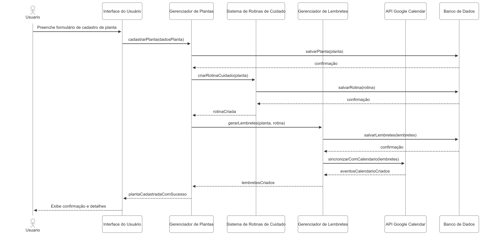
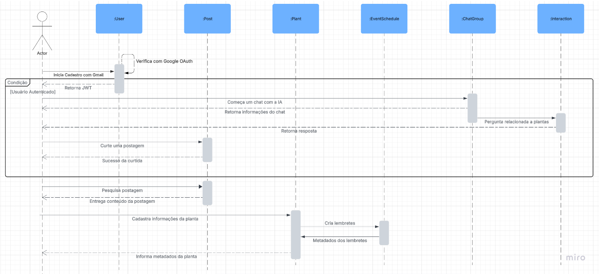
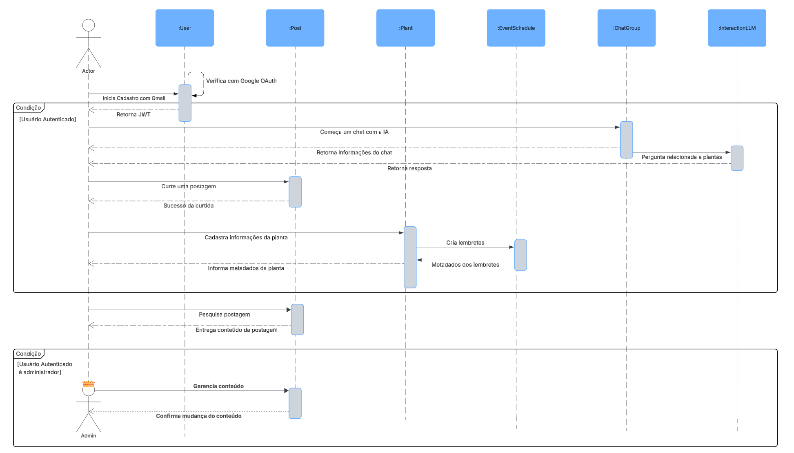

# Diagrama de Sequência

## Introdução

O Diagrama de sequência é uma representação que ilustra a sequência de mensagens trocadas entre os objetos de um sistema durante a execução e a ordem em que a interação ocorre dentro de um caso de uso específico. O diagrama consiste em um grupo de objetos representados por linhas de vida e mensagens trocadas entre eles durante a execução de um cenário. Ele é uma ferramenta utilizada para entender o comportamento dinâmico do sistema e como os objetos interagem entre si.

O Diagrama de Sequência pode ser utilizado em diferentes fases do desenvolvimento de software, como análise de requisitos, design e implementação. Ele é especialmente útil para descrever cenários complexos, onde a interação entre os objetos é fundamental para o entendimento do sistema.

## Rascunhos

Para alcançar o Diagrama de Sequência final (Figura 3) nos dedicamos um tempo para fazer rascunhos individuais do mesmo (Figuras 1 e 2), como um tipo de estudo e inicialização do processo:

<b>Figura 1: Rascunho 1 do Diagrama de Sequência</b>

<b>Autor:</b> [Davi Araújo Bady Casseb][dcasseb], 2025

---

<b>Figura 2: Rascunho 2 do Diagrama de Sequência</b>

<b>Autor:</b> [Mateus Vieira Rocha da Silva][mateusvrs], 2025

---

## Diagrama UML de Sequência

**Descrição**: O Diagrama de Sequência do projeto enfatiza a ordem temporal das mensagens trocadas pelos objetos. Nesse caso temos o *User*, *Post*, *Plant*, *EventSchedule*, *ChatGroup* e *InteractionLLM*. O *User* representa o processo de registro com o Google OAuth e o retorno do JWT. Os objetos *ChatGroup* e *InteractionLLM* representam o início de uma conversa entre o usuário, a API e o sistema externo de AI/LLM para dar as respectivas respostas. Além disso, temos o *Post* que gerencia o processo de curtir postagens, pesquisar e gerenciar o conteúdo do Plante Vc Mesmo. Por fim, temos os objetos *Plant* e *EventSchedule* que gerenciam o cadastro de novas plantas para poder receber lembretes a partir do Google Agenda

<b>Figura 3: Diagrama UML de Sequência Final</b>

<b>Autores:</b> [Arthur Ribeiro e Sousa][artrsousa1], [Mateus Vieira Rocha da Silva][mateusvrs], [Caio Felipe Rocha][caio-felipee], [Caio Falcão Habibe][CaioHabibe], [Caio Magalhães Lamego][caiolamego], [Gabriel Fernando De Jesus Silva][MMcLovin], [Rafael Melo Matuda][rmatuda], [Matheus de Siqueira Brant][MatheussBrant], 2025

## Histórico de Versão

| Versão | Data       | Alterações Principais                             | Autor(es)        |
|--------|------------|---------------------------------------------------|:----------------:|
| 1.0.0  | 06-05-2025 | Adição de fundamentação teórica                | [Arthur Ribeiro e Sousa][artrsousa1], [Caio Falcão Habibe][CaioHabibe], [Caio Felipe Rocha][caio-felipee] |
| 1.0.1  | 06-05-2025 | Adição dos rascunho | [Arthur Ribeiro e Sousa][artrsousa1], [Mateus Vieira Rocha da Silva][mateusvrs], [Caio Felipe Rocha][caio-felipee]   [Caio Falcão Habibe][CaioHabibe], [Caio Magalhães Lamego][caiolamego], [Gabriel Fernando De Jesus Silva][MMcLovin]   [Rafael Melo Matuda][rmatuda], [Matheus de Siqueira Brant][MatheussBrant] |
| 1.0.2  | 06-05-2025 | Adição do diagrama de sequência final | [Arthur Ribeiro e Sousa][artrsousa1], [Mateus Vieira Rocha da Silva][mateusvrs], [Caio Felipe Rocha][caio-felipee]   [Caio Falcão Habibe][CaioHabibe], [Caio Magalhães Lamego][caiolamego], [Gabriel Fernando De Jesus Silva][MMcLovin]   [Rafael Melo Matuda][rmatuda], [Matheus de Siqueira Brant][MatheussBrant] |

[artrsousa1]: https://github.com/artrsousa1  
[CaioHabibe]: https://github.com/CaioHabibe  
[caio-felipee]: https://github.com/caio-felipee  
[caiolamego]: https://github.com/caiolamego  
[dcasseb]: https://github.com/dcasseb  
[MMcLovin]: https://github.com/MMcLovin  
[mateusvrs]: https://github.com/mateusvrs  
[MatheussBrant]: https://github.com/MatheussBrant  
[PedroHenrique061]: https://github.com/PedroHenrique061  
[rmatuda]: https://github.com/rmatuda
