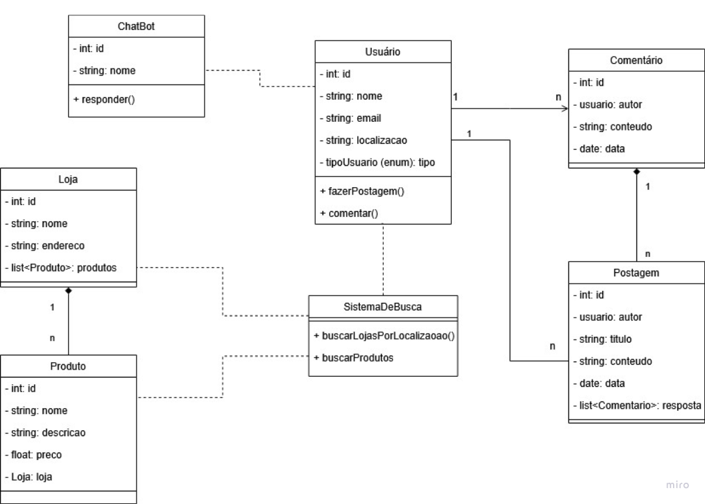

# Diagrama de Classes

## Introdução

O Diagrama de Classes é um dos principais diagramas da UML (Unified Modeling Language). É uma etapa fundamental para o processo de modelagem de objetos e modelam a estrutura estática de um sistema. Ele descreve as classes do sistema, seus atributos, métodos e os relacionamentos entre elas.

Ele é especialmente útil na fase de análise e design do sistema,pois facilita a identificação das classes a serem implementadas, suas responsabilidades e as interações entre elas. Ao proporcionar uma visão clara e organizada da arquitetura do sistema, o Diagrama de Classes ajuda a garantir que os requisitos funcionais e não funcionais sejam atendidos de forma eficaz.

## Rascunhos

Para auxiliar na construção do diagrama de classes, foi acordado que cada membro produziria indivudualmente um rascunho inicial para servir como auxílio da construção do diagrama de classes final. Abaixo estão os rascunhos produzidos pelos membros da equipe.

### Rascunho 1

<b>Figura 1: Rascunho do Diagrama de Classes por Caio Felipe</b>

<b>Autor:</b> [Caio Felipe Rocha][caio-felipee], 2025

---
### Rascunho 2

<b>Figura 2: Rascunho do Diagrama de Classes por Caio Lamego</b>

<b>Autor:</b> [Caio Magalhães Lamego][caiolamego], 2025

---
### Rascunho 3

<b>Figura 3: Rascunho do Diagrama de Classes por Davi</b>

<b>Autor:</b> [Davi Araújo Bady Casseb][dcasseb], 2025

---
### Rascunho 4

<b>Figura 4: Rascunho do Diagrama de Classes por Mateus Vieira</b>

<b>Autor:</b> [Mateus Vieira Rocha da Silva][mateusvrs], 2025

---
### Rascunho 5

<b>Figura 5: Rascunho do Diagrama de Classes por Gabriel Fernando</b>

<b>Autor:</b> [Gabriel Fernando De Jesus Silva][MMcLovin], 2025

## Diagrama UML de Classes

<b>Figura 6: Diagrama UML de Classes (Final)</b>

<b>Autor:</b> [Arthur Ribeiro e Sousa][artrsousa1], [Caio Felipe Rocha][caio-felipee], [Caio Magalhães Lamego][caiolamego], [Gabriel Fernando De Jesus Silva][MMcLovin], [Mateus Vieira Rocha da Silva][mateusvrs], 2025

**Descrição**: O diagrama desenvolvido contém 11 classes sendo uma delas o Auditable, uma classe abstrata usada para herança e controle de auditoria do sistema, além de uma classe terceirizada, a Product, que contém dados que serão fornecidos através de uma API. Por fim, o diagrama traz os principais envolvidos no sistema como usuário, planta, comentários, Post e etc.

## Histórico de Versão

| Versão | Data       | Alterações Principais                             | Autor(es)        |
| ------ | ---------- | ------------------------------------------------- | ---------------- |
| 1.0.0  | 06-05-2025 | Adição de fundamentação teórica                | [Arthur Ribeiro e Sousa][artrsousa1], [Caio Falcão Habibe][CaioHabibe], [Caio Felipe Rocha][caio-felipee] |
| 1.0.1  | 06-05-2025 | Adição do diagrama final | [Caio Magalhães Lamego][caiolamego], [Gabriel Fernando De Jesus Silva][MMcLovin]   [Rafael Melo Matuda][rmatuda], [Matheus de Siqueira Brant][MatheussBrant] |
| 1.0.2  | 06-05-2025 | Adição dos rascunhos | [Arthur Ribeiro e Sousa][artrsousa1], [Caio Falcão Habibe][CaioHabibe], [Caio Felipe Rocha][caio-felipee]   [Caio Magalhães Lamego][caiolamego], [Gabriel Fernando De Jesus Silva][MMcLovin]   [Rafael Melo Matuda][rmatuda], [Matheus de Siqueira Brant][MatheussBrant], [Mateus Vieira Rocha da Silva][mateusvrs] |
| 1.0.3  | 08-05-2025 | Padronização dos títulos e rodapé das imagens | [Gabriel Fernando De Jesus Silva][MMcLovin] |

[artrsousa1]: https://github.com/artrsousa1  
[CaioHabibe]: https://github.com/CaioHabibe  
[caio-felipee]: https://github.com/caio-felipee  
[caiolamego]: https://github.com/caiolamego  
[dcasseb]: https://github.com/dcasseb  
[MMcLovin]: https://github.com/MMcLovin  
[mateusvrs]: https://github.com/mateusvrs  
[MatheussBrant]: https://github.com/MatheussBrant  
[PedroHenrique061]: https://github.com/PedroHenrique061  
[rmatuda]: https://github.com/rmatuda
