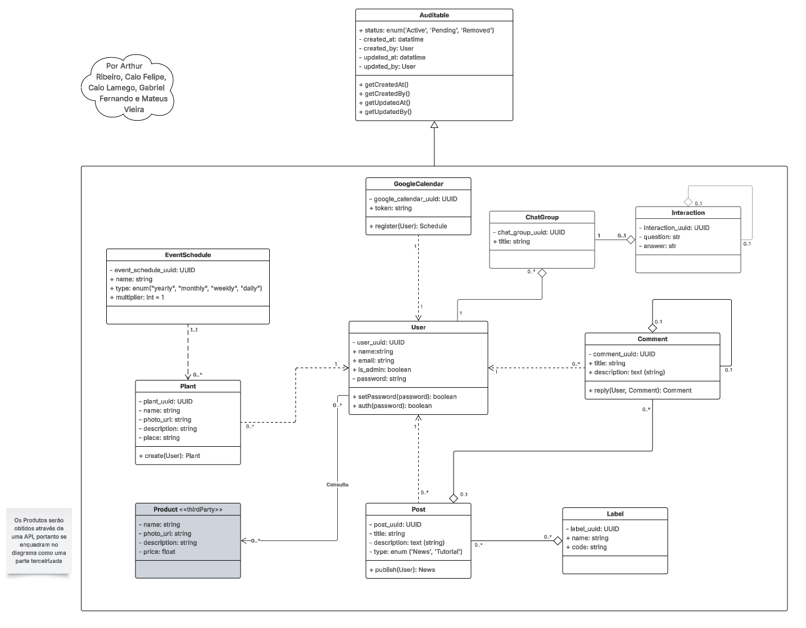

# Diagrama de Classes

## Introdução

O Diagrama de Classes é um dos principais diagramas da UML (Unified Modeling Language). É uma etapa fundamental para o processo de modelagem de objetos e modelam a estrutura estática de um sistema. Ele descreve as classes do sistema, seus atributos, métodos e os relacionamentos entre elas.

Ele é especialmente útil na fase de análise e design do sistema,pois facilita a identificação das classes a serem implementadas, suas responsabilidades e as interações entre elas. Ao proporcionar uma visão clara e organizada da arquitetura do sistema, o Diagrama de Classes ajuda a garantir que os requisitos funcionais e não funcionais sejam atendidos de forma eficaz.

## Diagrama UML

Descrição: O diagrama desenvolvido contém 11 classes sendo uma delas o Auditable, uma classe abstrata usada para herança e controle de auditoria do sistema, além de uma classe terceirizada, a Product, que contém dados que serão fornecidos através de uma API. Por fim, o diagrama traz os principais envolvidos no sistema como usuário, planta, comentários, Post e etc.

## Histórico de Versão
| Versão | Data       | Alterações Principais                             | Autor(es)        |
|--------|------------|---------------------------------------------------|:----------------:|
| 1.0.0  | 06-05-2025 | Adição de fundamentação teórica                | Arthur Ribeiro, Caio Habibe, Caio Felipe   |

