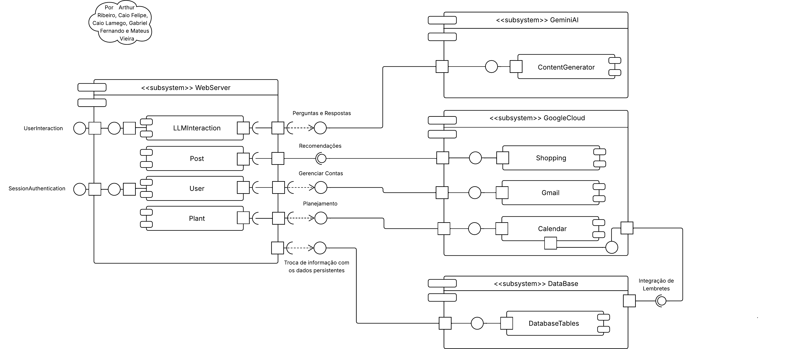

# Diagrama de Componentes

## Introdução

O Diagrama de Componentes é uma representação visual da estrutura do sistema de software, que descreve os componentes do sistema, as suas interfaces e suas dependências. Ele é uma parte importante da modelagem de software, pois ajuda a entender como os diferentes componentes interagem entre si e como eles se encaixam na arquitetura geral do sistema.

Além disso, o Diagrama de Componentes é útil para definir quais são os componentes reutilizáveis, descobrir dependências entre componentes e identificar possíveis problemas de integração. Ele também pode ser usado para documentar a arquitetura do sistema e facilitar a comunicação entre os membros da equipe de desenvolvimento.

## Diagrama UML

<b>Figura 1: Diagrama de Componentes</b>

<b>Autores:</b> [Arthur Ribeiro e Sousa][artrsousa1], [Caio Felipe Rocha][caio-felipee], [Caio Magalhães Lamego][caiolamego], [Gabriel Fernando De Jesus Silva][MMcLovin], [Mateus Vieira Rocha da Silva][mateusvrs], 2025

**Descrição**: O Diagrama de Componentes (Figura 1) traz a arquitetura do Plante Vc Mesmo! dividida em quatro subsistemas (WebServer, GeminiAI, GoogleCloud e DataBase). O **WebServer** gerencia interações do usuário, já o **GeminAI** é responsável pela geração de conteúdo quando há a comunicação com o WebServer, enquanto o **GoogleCloud** será utilizado para funcionalidades de Shopping, Gmail e agendamentos no Calendar. Por fim, o **DataBase** é integrado ao sistema para garantir a integridade e persistência dos dados.

## Histórico de Versão
| Versão | Data       | Alterações Principais                             | Autor(es)                                                                 |
|--------|------------|---------------------------------------------------|---------------------------------------------------------------------------|
| 1.0.0  | 06-05-2025 | Adição de fundamentação teórica                | [Arthur Ribeiro e Sousa][artrsousa1], [Mateus Vieira Rocha da Silva][mateusvrs], [Caio Felipe Rocha][caio-felipee] |
| 1.0.1  | 08-05-2025 | Adiciona título, rodapé e chamada à Figura 1 | [Gabriel Fernando de Jesus Silva][MMcLovin]   |

<!-- Links de referência -->
[artrsousa1]: https://github.com/artrsousa1
[caio-felipee]: https://github.com/caio-felipee
[caiolamego]: https://github.com/caiolamego
[MMcLovin]: https://github.com/MMcLovin
[mateusvrs]: https://github.com/mateusvrs