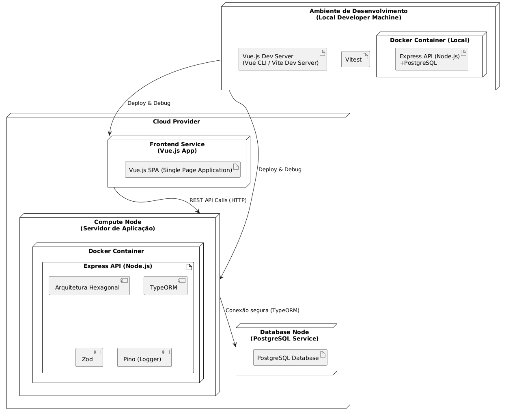

# Diagrama de Implantação

## Introdução

O Diagrama de Implantação é uma representação visual da arquitetura física de um sistema, mostrando como os componentes de software são mapeados para os nós de hardware e infraestrutura. Este tipo de diagrama descreve a configuração dos elementos no momento da execução, incluindo servidores, containers, serviços externos e conexões de rede.

Ele é essencial para entender onde e como cada parte do sistema está hospedada e como se comunicam entre si, além de ajudar a identificar gargalos de infraestrutura, dependências físicas e facilitar operações de deploy e manutenção.

## Diagrama UML

Descrição: O Diagrama de Implantação apresenta a arquitetura física do sistema, que é composta por dois ambientes principais: o Ambiente de Desenvolvimento (máquina local do desenvolvedor) e o Ambiente Cloud (ambiente de produção).

- Ambiente de Desenvolvimento: Inclui um servidor de desenvolvimento Vue.js (utilizando Vue CLI ou Vite) e um container Docker local rodando a API Express (Node.js) integrada com PostgreSQL para desenvolvimento e testes. O Vitest é usado para execução dos testes automatizados localmente.

- Cloud Provider: É composto por dois serviços principais:
  - Frontend Service: Uma aplicação Vue.js SPA (Single Page Application) hospedada no provedor cloud.
  - Compute Node: Um container Docker que executa a API Express (Node.js), estruturada com Arquitetura Hexagonal, usando TypeORM para ORM, Zod para validação de dados e Pino para logging.
  
- Database Node: Um serviço PostgreSQL dedicado, que recebe conexões seguras da API.

A comunicação ocorre via REST API Calls (HTTP) entre o Frontend e a API backend, e uma conexão segura entre a API e o banco de dados, garantindo integridade e segurança dos dados.

## Histórico de Versão

| Versão | Data       | Alterações Principais                                      | Autor(es)                                   |
|--------|------------|------------------------------------------------------------|:------------------------------------------:|
| 1.0.0  | 08-05-2025 | Criação inicial do diagrama e descrição completa do sistema | Matheus Brant, Rafael Matuda                               |
