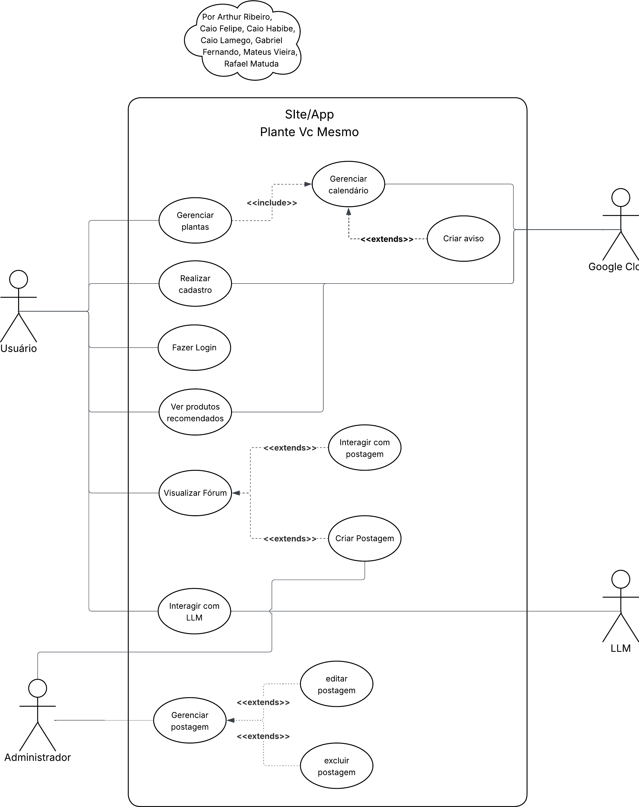

# Diagrama de Casos de Uso

## Introdução

Na UML, os diagramas de caso de uso modelam o comportamento de um sistema e ajudam a capturar os requisitos do sistema. Ele desempenha um papel essencial no processo de modelagem de sistemas, pois representa de forma visual as funcionalidades que o sistema deve oferecer, bem como os atores que interagem com essas funcionalidades.

Esse diagrama é especialmente útil nas fases iniciais do desenvolvimento, como levantamento de requisitos e análise, pois facilita a identificação dos principais objetivos do sistema do ponto de vista do usuário. Ao ilustrar as interações entre os atores (usuários ou outros sistemas) e os casos de uso, o Diagrama de Casos de Uso proporciona uma visão clara e de alto nível sobre o que o sistema deve realizar.

## Diagrama UML

Descrição: O Diagrama de Caso de Uso do Plante Vc Mesmo! contém quatro atores: Usuário, Administrador, Google Cloud e LLM. O Usuário gerencia plantas, realiza cadastro/login, visualiza fórum, interage com LLM, cria postagem e etc. Já o Administrador tem funções essenciais como adicionar, editar e excluir postagens. Por fim, há a interação do sistema com os serviços externos (GoogleCloud e LLM) para suporte com funcionalidades específicas do sistema.

## Tabela de Casos de Uso

| Código | Nome do caso de uso        |
|--------|----------------------------|
| UC01   | Gerenciar Calendário       |
| UC02   | Criação de Plantas         |
| UC04   | Realizar Cadastro          |
| UC05   | Login na Google            |
| UC05   | Interagir com postagem     |
| UC09   | Interagir com LLM          |

### UC01 - Gerenciar Calendário

|                      |                                                                                             |
|----------------------|---------------------------------------------------------------------------------------------|
| **Descrição**        | Este Caso de Uso descreve o fluxo no qual o usuário gerencia o calendário de cuidados com suas plantas. O usuário pode visualizar o calendário, adicionar, editar e excluir avisos de cuidado, bem como receber lembretes automáticos recomendados pelo sistema. |
| **Ator(es)**         | Usuário do aplicativo "Plante Você Mesmo"; Sistema                                          |
| **Pré-Requisitos**   | O usuário deve estar autenticado no aplicativo e ter ao menos uma planta cadastrada para gerenciar eventos. |

| **Fluxo Principal**  |
|----------------------|
| 1. O usuário acessa a funcionalidade de Gerenciar Calendário. |
| 2. O usuário visualiza o calendário com os eventos já cadastrados. |
| 3. O usuário escolhe entre adicionar, editar ou excluir um aviso. |
| 4. Caso adicione um aviso, o sistema recomenda automaticamente a melhor data para o cuidado da planta. (FA1) |
| 5. O usuário pode aceitar ou modificar a data sugerida pelo sistema. |
| 6. O sistema salva as alterações no calendário. (FE1) |
| 7. O sistema programa o envio de lembretes conforme os avisos cadastrados. |
| 8. O usuário recebe lembretes automáticos sobre os cuidados no momento adequado. (FE2) |

| **Fluxos Alternativos** |
|-------------------------|
| **FA1** - O usuário pode optar por não seguir a recomendação de data e inserir manualmente a data do aviso. |

| **Fluxos de Exceção**   |
|-------------------------|
| **FE1** - Falha ao salvar o aviso: o sistema exibe uma mensagem de erro e solicita nova tentativa. |
| **FE2** - Falha ao enviar lembrete: o sistema registra a falha e tenta reprogramar o envio. |

Autor: Matheus Brant

### UC02 - Criação de Plantas
|                      |                                                                                             |
|----------------------|---------------------------------------------------------------------------------------------|
| **Descrição**        | Este Caso de Uso deve seguir um fluxo onde o usuário Crie uma Nova Planta no seu perfil, sendo necessário, dessa maneira, informar nome, descrição e foto, para que esta seja salva corretamente no seu perfil. |
| **Ator(es)**         | Usuário do aplicativo "Plante Você Mesmo"                                                   |
| **Pré-Requisitos**   | O usuário deve estar logado no aplicativo e ter acesso à funcionalidade de criação de plantas. |

| **Fluxo Principal**  |
|----------------------|
| 1. Usuário acessa seu perfil.  |
| 2. Usuário clica no botão de Adicionar Planta. (FA1)  |
| 3. O usuário insere o nome, descrição da Planta.|
| 4. O usuário faz upload da foto da planta. (FE3)|
| 5. O usuário clica para confirmar. (FE2)|
| 9. O sistema exibe uma confirmação de que a planta foi criada com sucesso. (FE1) |
| 10. O usuário visualiza a nova planta em seu perfil. |

| **Fluxo Alternativo** |
|------------------------|
| FA1. Se o usuário cancelar a criação da planta, o sistema retorna à tela inicial da área de plantas.  |

| **Fluxo de Exceção** |
|------------------------|
| FE1. Se ocorrer um erro ao salvar a planta, o sistema exibe uma mensagem de erro. |
| FE2. Se o usuário não preencher algum campo, o sistema solicita que o usuário preencha todos.  |
| FE3. Se o formato da foto enviada for inválido, o sistema solicita ao usuário que envie um arquivo de imagem válido.  |

Autor: Caio Lamego

### UC03 - Edição de Planta
|  |  |
|--------------------|-----------------------------------------------|
| **Descrição**      | Este caso de uso permite que o usuário modifique informações sobre uma planta já cadastrada no sistema, incluindo dados básicos, rotina de cuidados e imagens. |
| **Ator(es)**       | Usuário (proprietário da planta)                     |
| **Pré-Requisitos** | 1. O usuário deve estar autenticado na plataforma. 2. O usuário deve ter pelo menos uma planta cadastrada. 3. O usuário deve ter permissões para editar a planta selecionada. |
| **Fluxo Principal** | FP01. O caso de uso começa quando o usuário seleciona a opção "Editar" em uma planta específica na sua lista de plantas. FP02. O sistema exibe um formulário preenchido com as informações atuais da planta. FP03. O usuário modifica os dados desejados, que podem incluir: nome da planta, espécie, data de aquisição, localização na casa, descrição e fotografia. [FA01][FA02] FP04. O usuário seleciona a opção para editar a rotina de cuidados da planta. [FA03] FP05. O sistema apresenta as configurações atuais da rotina de cuidados. FP06. O usuário modifica parâmetros da rotina como frequência de rega, frequência de adubação, necessidades de luz, e instruções especiais. [FE01] FP07. O usuário confirma as alterações na rotina de cuidados. FP08. O usuário seleciona a opção "Salvar" para confirmar todas as alterações realizadas na planta. [FE02] FP09. O sistema valida as informações inseridas. [FE03] FP10. O sistema atualiza os dados da planta no banco de dados. FP11. O sistema recalcula os próximos lembretes de cuidados com base na rotina atualizada. FP12. O sistema sincroniza os lembretes atualizados com o Google Calendar do usuário. [FE04] FP13. O sistema exibe uma mensagem de confirmação de que a planta foi atualizada com sucesso. FP14. O caso de uso é encerrado e o sistema retorna para a visualização detalhada da planta atualizada. |
| **Fluxo Alternativo** | FA01. Trocar fotografia da planta FA01.1. No passo FP03, o usuário seleciona a opção para trocar a foto da planta. FA01.2. O sistema apresenta opções para fazer upload de uma nova foto, tirar uma foto com a câmera ou escolher uma imagem da galeria. FA01.3. O usuário seleciona o método desejado e fornece a nova imagem. [FE05] FA01.4. O sistema processa e armazena temporariamente a nova imagem. FA01.5. O sistema retorna ao passo FP03 do fluxo principal.  FA02. Cancelar edição FA02.1. Em qualquer ponto após o passo FP02, o usuário seleciona a opção "Cancelar". FA02.2. O sistema exibe uma mensagem perguntando se o usuário deseja descartar as alterações não salvas. FA02.3. O usuário confirma que deseja cancelar a edição. FA02.4. O sistema descarta todas as alterações não salvas. FA02.5. O caso de uso é encerrado e o sistema retorna para a visualização anterior.  FA03. Pular edição da rotina de cuidados FA03.1. No passo FP04, o usuário decide não editar a rotina de cuidados. FA03.2. O sistema mantém as configurações atuais da rotina de cuidados. FA03.3. O fluxo continua no passo FP08. |
| **Fluxo de Exceção** | FE01. Valor inválido na rotina de cuidados FE01.1. No passo FP06, o usuário insere um valor inválido para algum parâmetro da rotina (como frequência negativa de rega). FE01.2. O sistema exibe uma mensagem de erro indicando o problema específico. FE01.3. O sistema mantém o formulário aberto com os dados inseridos, destacando o campo com erro. FE01.4. O usuário corrige o valor ou cancela a operação. FE01.5. O fluxo retorna ao passo FP06.  FE02. Falha ao salvar FE02.1. No passo FP08, ocorre uma falha técnica ao tentar salvar as alterações. FE02.2. O sistema exibe uma mensagem informando sobre o problema. FE02.3. O sistema oferece opções para tentar novamente ou salvar um rascunho das alterações. FE02.4. O usuário escolhe uma das opções. FE02.5. Se escolher tentar novamente, o fluxo retorna ao passo FP08. FE02.6. Se escolher salvar rascunho, o sistema armazena as alterações localmente e o caso de uso é encerrado.  FE03. Dados inválidos FE03.1. No passo FP09, o sistema detecta dados inválidos ou inconsistentes. FE03.2. O sistema exibe mensagens específicas para cada campo com problema. FE03.3. O sistema mantém o formulário aberto com os dados inseridos, destacando os campos com erro. FE03.4. O usuário corrige os dados ou cancela a operação. FE03.5. Se o usuário corrigir os dados, o fluxo retorna ao passo FP09.  FE04. Falha na sincronização com o Google Calendar FE04.1. No passo FP12, ocorre uma falha na sincronização com o Google Calendar. FE04.2. O sistema registra a falha e salva os lembretes localmente. FE04.3. O sistema informa ao usuário sobre a falha na sincronização e que os lembretes estão disponíveis apenas na plataforma. FE04.4. O sistema oferece a opção de tentar sincronizar novamente mais tarde. FE04.5. O fluxo continua no passo FP13.  FE05. Falha no processamento da imagem FE05.1. No passo FA01.3, ocorre um problema ao processar a imagem (tamanho muito grande, formato incompatível, etc.). FE05.2. O sistema exibe uma mensagem informando o problema específico. FE05.3. O sistema oferece orientações sobre os requisitos da imagem. FE05.4. O usuário fornece uma nova imagem ou cancela a operação. FE05.5. Se o usuário fornecer uma nova imagem, o fluxo retorna ao passo FA01.3. |

Autor: Davi Araújo

### UC04 - Realizar Cadastro

|  |  |
|--------------------|-----------------------------------------------|
| **Descrição**      | Permite que o usuário crie uma conta no sistema “Plante Você Mesmo” para acessar funcionalidades como registro de plantações, acompanhamento e dicas personalizadas. |
| **Ator(es)**       | Usuário (pessoa interessada em plantar), Sistema |
| **Pré-Requisitos** | O usuário deve ter acesso à internet e dispor de um dispositivo compatível (celular, tablet ou computador). |

| **Fluxo Principal** | 
|------------------------| 
|1. O usuário acessa a página inicial do sistema. | 
|2. O usuário seleciona a opção “Cadastrar-se”. | 
|3. O sistema apresenta o formulário de cadastro.|  
|4. O usuário preenche os campos obrigatórios (nome, e-mail, senha, etc.).|  
|5. O usuário confirma o cadastro.|  
|6. O sistema valida as informações. | 
|7. O sistema cria a conta e exibe mensagem de sucesso.  |
|8. O usuário é redirecionado para a tela inicial logado no sistema. |

| **Fluxo Alternativo** |
|------------------------|  
FA01. (Após FP04) O usuário opta por se cadastrar usando redes sociais (Google, Facebook).  
→ O sistema redireciona para a autenticação da rede social.  
 → Após a autenticação, o sistema cria a conta automaticamente e exibe mensagem de sucesso. |

| **Fluxo de Exceção** |
|------------------------|  
FE01. (No FP06) O e-mail informado já está cadastrado.  
→ O sistema exibe mensagem de erro e solicita um novo e-mail.  

FE02. (No FP06) O usuário deixa campos obrigatórios em branco.  
→ O sistema exibe mensagens de validação e impede o avanço até que sejam corrigidos.  

FE03. (No FP06) Falha na conexão com o servidor.  
→ O sistema exibe mensagem de erro e solicita que o usuário tente novamente mais tarde. |

Autor: Rafael Matuda

### UC05 - Login na Google
|  |  |
|--------------------|-----------------------------------------------|
| **Descrição**      | Permite que um usuário acesse a plataforma utilizando sua conta da Google |
| **Ator(es)**       | Um usuário com uma conta Google        |
| **Pré-Requisitos** | O usuário já deve possuir uma conta na Google |
| **Fluxo Principal** | 1. O usuário acessa a tela de login  2. O usuário clica no botão "Login com Google"  3. O usuário é redirecionado para a página de autenticação do Google  4. O usuário a conta desejada e informa a sua senha  5. O Google autentica o usuário e redireciona de volta com um token de autorização  6. O sistema busca os dados do usuário nas API's da Google  7. O sistema gera uma sessão e redireciona o usuário para a página inicial   |
| **Fluxo Alternativo** | **FA01:** O usuário cancela a autorização na tela do Google e o sistema retorna para a tela de login sem a autenticação |
| **Fluxo de Exceção** | **FE01:** O token informado é inválido ou expirado e o sistema exibe uma mensagem de erro |

Autor: Arthur Ribeiro

### UC06 - Criar postagem

|  |  |
|--------------------|-----------------------------------------------|
| **Descrição**      | O usuário deseja criar uma nova postagem para compartilhar conteúdo na plataforma |
| **Ator(es)**       | Usuário |
| **Pré-Requisitos** | O usuário deve possuir uma conta ativa e estar autenticado no sistema |
| **Fluxo Principal** | 1. O usuário acessa a interface de criação de postagem 2.O sistema exibe o formulário de nova postagem 3. O usuário preenche os campos obrigatórios (título, conteúdo) 4.  O usuário adiciona, se desejar, imagens ou categorias  5. O usuário clica no botão “Publicar” 6. O sistema valida os dados inseridos 7. O sistema salva a postagem no banco de dados 8.O sistema exibe uma mensagem de sucesso confirmando a criação da postagem |
| **Fluxo Alternativo** | **FA01: O usuário salva a postagem como rascunho** 1.  O usuário preenche parcialmente o formulário 2. O usuário clica no botão “Salvar como rascunho” 3. O sistema salva os dados incompletos como rascunho 4 .O sistema confirma que o rascunho foi salvo com sucesso|
| **Fluxo de Exceção** | **FE01: Dados obrigatórios não preenchidos** 1. O sistema identifica que título ou conteúdo não foram preenchidos 2 .O sistema exibe uma mensagem de erro solicitando o preenchimento dos campos obrigatórios  **FE02:  Falha ao salvar a postagem** 1. O sistema tenta salvar a postagem, mas ocorre um erro no banco de dados 2 .O sistema exibe uma mensagem de erro informando que não foi possível concluir a operação e sugere tentar novamente mais tarde|

Autor: Pedro Henrique

### UC07 - Interagir com postagem

|  |  |
|--------------------|-----------------------------------------------|
| **Descrição**          | O usuário deseja interagir com uma postagem. |
| **Ator(es)**           | Usuário autenticado                                             |
| **Pré-Requisitos**     | O usuário deve estar autenticado e visualizar uma postagem disponível para interação. |
| **Fluxo Principal**    | 1. O usuário acessa a postagem. 2. O sistema exibe as opções de interação (curtir, comentar, compartilhar). 3. O usuário seleciona uma das opções de interação. 4. O sistema registra a interação e atualiza a postagem em tempo real. |
| **Fluxo Alternativo**  | **FA01**: O usuário decide cancelar a interação antes de confirmar. **FA02**: O usuário escolhe mais de uma opção de interação (por exemplo, curtir e comentar). O sistema registra todas as interações realizadas. |
| **Fluxo de Exceção**   | **FE01**: Ocorre uma falha de conexão: o sistema exibe uma mensagem de erro e orienta o usuário a tentar novamente. |

Autor: Caio Habibe
### UC08 - Gerenciar Postagem
|  |  |
|--------------------|-----------------------------------------------|
| **Descrição**      | O administrador deseja editar ou excluir uma postagem publicada |
| **Ator(es)**       | Administrador |
| **Pré-Requisitos** | Estar autenticado no sistema e ter pelo menos uma postagem publicada |
| **Fluxo Principal** | 1. O administrador acessa a área de gerenciamento de postagens 2. O sistema exibe a lista de postagens publicadas 3. O administrador seleciona uma postagem 4. O sistema exibe as opções de gerenciamento (editar/excluir) 5. O administrador escolhe a opção de edição 6. O sistema abre a postagem em modo de edição 7. O administrador faz as alterações e salva 7.1 Caso ocorra um erro ao salvar, **FE01** 8. O sistema atualiza a postagem e retorna à visualização da lista |
| **Fluxo Alternativo** | **FA01: O administrador escolhe excluir a postagem** 1. O administrador clica em "Excluir" 2. O sistema solicita confirmação 3. O administrador confirma a exclusão 4. O sistema remove a postagem da exibição pública |
| **Fluxo de Exceção** | **FE01: Erro ao salvar a edição da postagem** 1. O sistema exibe uma mensagem de erro 2. O administrador pode tentar salvar novamente ou cancelar a edição |

### UC09 - Interagir com LLM
|  |  |
|--------------------|-----------------------------------------------|
| **Descrição**      | O usuário deseja interagir com o sistema de IA generativa |
| **Ator(es)**       | Usuário |
| **Pré-Requisitos** | Possuir uma conta ativa e estar autenticado |
| **Fluxo Principal** | 1. Usuário abre o sistema de chat 2. O sistema mostra os chats do usuário 3. O usuário escolhe o chat &#9;3.1 O usuário também pode criar um chat novo, indo para o **FA01** 4. O usuário é redirecionado para o chat escolhido 5. O usuário envia uma mensagem &#9;5.1 O sistema verifica se o usuário excedeu o limite de mensagens diárias. Caso positivo, **FE01** 6. O sistema retorna a resposta utilizando IA 6.1 Caso não seja possível gerar uma resposta, **FE02** 7. O sistema incrementa em uma unidade a quantidade de mensagens diárias do usuário |
| **Fluxo Alternativo** | **FA01: O usuário cria um novo chat** 1. O usuário adiciona o título do novo chat 2. O usuário clica no botão de criar novo chat 3. O sistema cria um novo chat|
| **Fluxo de Exceção** | **FE01: O usuário excedeu o limite de mensagens diárias** 1. O sistema mostra uma mensagem sinalizando que o usuário está com o limite de mensagens excedido  **FE02: O sistema não consegue gerar uma resposta** 1. O sistema exibe uma mensagem sinalizando a indisponibilidade temporária do uso de IA generativa|

Autor: Caio Felipe

## Histórico de Versão

| Versão | Data | Alterações Principais | Autor(es) |
| ------ | ---- | --------------------- | :-------: |
| 1.0.0  | 06-05-2025 | Adição de fundamentação teórica                | Arthur Ribeiro, Mateus Vieira, Caio Felipe   Caio Habibe, Caio Lamego, Gabriel Fernando   Rafael Matuda   |
| 1.0.1  | 06-05-2025 | Adição do UC02 e UC04 | Caio Lamego, Rafael Matuda |
| 1.0.2  | 06-05-2025 | Adição do UC09 | Caio Felipe |
| 1.0.3  | 06-05-2025 | Adição do UC05 | Arthur Ribeiro |
| 1.0.3  | 08-05-2025 | Adição do UC06 | Pedro Henrique |
| 1.0.4  | 06-05-2025 | Adição do UC07 | Caio Habibe |
| 1.0.5  | 06-05-2025 | Adição do UC01 | Matheus Brant |

[artrsousa1]: https://github.com/artrsousa1  
[CaioHabibe]: https://github.com/CaioHabibe  
[caio-felipee]: https://github.com/caio-felipee  
[caiolamego]: https://github.com/caiolamego  
[dcasseb]: https://github.com/dcasseb  
[MMcLovin]: https://github.com/MMcLovin  
[mateusvrs]: https://github.com/mateusvrs  
[MatheussBrant]: https://github.com/MatheussBrant  
[PedroHenrique061]: https://github.com/PedroHenrique061  
[rmatuda]: https://github.com/rmatuda  
