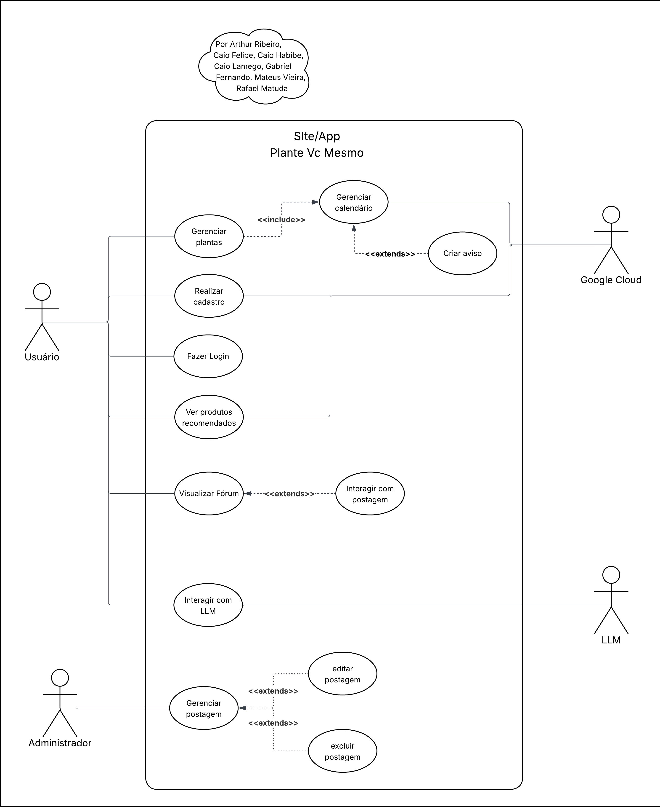

# Diagrama de Casos de Uso

## Introdução

Na UML, os diagramas de caso de uso modelam o comportamento de um sistema e ajudam a capturar os requisitos do sistema. Ele desempenha um papel essencial no processo de modelagem de sistemas, pois representa de forma visual as funcionalidades que o sistema deve oferecer, bem como os atores que interagem com essas funcionalidades.

Esse diagrama é especialmente útil nas fases iniciais do desenvolvimento, como levantamento de requisitos e análise, pois facilita a identificação dos principais objetivos do sistema do ponto de vista do usuário. Ao ilustrar as interações entre os atores (usuários ou outros sistemas) e os casos de uso, o Diagrama de Casos de Uso proporciona uma visão clara e de alto nível sobre o que o sistema deve realizar.

## Diagrama UML

Descrição: O Diagrama de Caso de Uso do Plante Vc Mesmo! contém quatro atores: Usuário, Administrador, Google Cloud e LLM. O Usuário gerencia plantas, realiza cadastro/login, visualiza fórum, interage com LLM, cria postagem e etc. Já o Administrador tem funções essenciais como adicionar, editar e excluir postagens. Por fim, há a interação do sistema com os serviços externos (GoogleCloud e LLM) para suporte com funcionalidades específicas do sistema.

## Template para criação de Casos de Uso

### UC00 - Nome do Caso de Uso
|  |  |
|--------------------|-----------------------------------------------|
| **Descrição**      | Um breve resumo do que é o caso de uso |
| **Ator(es)**       | Quem está praticando o caso de uso                        |
| **Pré-Requisitos** | O que é necessário para que ele ocorra |
| **Fluxo Principal** | Sequência de passos normal do caso de uso e os fluxos alternativaos e de execção a frente do passo que eles podem ocorrer |
| **Fluxo Alternativo** | É um caminho diferente que o usuário pode seguir para completar a mesma tarefa, geralmente devido a uma escolha ou condição específica. |
| **Fluxo de Exceção** | É o caminho que o sistema segue quando ocorre um erro ou uma condição inesperada, exigindo uma ação corretiva. |

## Tabela de Casos de Uso

| Código | Nome do caso de uso        |
|--------|----------------------------|
| UC01   | Gerenciar Calendário       |
| UC02   | Criação de Plantas         |
| UC05   | Login na Google            |
| UC09   | Interagir com LLM          |

### UC01 - Gerenciar Calendário

|                      |                                                                                             |
|----------------------|---------------------------------------------------------------------------------------------|
| **Descrição**        | Este Caso de Uso descreve o fluxo no qual o usuário gerencia o calendário de cuidados com suas plantas. O usuário pode visualizar o calendário, adicionar, editar e excluir avisos de cuidado, bem como receber lembretes automáticos recomendados pelo sistema. |
| **Ator(es)**         | Usuário do aplicativo "Plante Você Mesmo"; Sistema                                          |
| **Pré-Requisitos**   | O usuário deve estar autenticado no aplicativo e ter ao menos uma planta cadastrada para gerenciar eventos. |

| **Fluxo Principal**  |
|----------------------|
| 1. O usuário acessa a funcionalidade de Gerenciar Calendário. |
| 2. O usuário visualiza o calendário com os eventos já cadastrados. |
| 3. O usuário escolhe entre adicionar, editar ou excluir um aviso. |
| 4. Caso adicione um aviso, o sistema recomenda automaticamente a melhor data para o cuidado da planta. (FA1) |
| 5. O usuário pode aceitar ou modificar a data sugerida pelo sistema. |
| 6. O sistema salva as alterações no calendário. (FE1) |
| 7. O sistema programa o envio de lembretes conforme os avisos cadastrados. |
| 8. O usuário recebe lembretes automáticos sobre os cuidados no momento adequado. (FE2) |

| **Fluxos Alternativos** |
|-------------------------|
| **FA1** - O usuário pode optar por não seguir a recomendação de data e inserir manualmente a data do aviso. |

| **Fluxos de Exceção**   |
|-------------------------|
| **FE1** - Falha ao salvar o aviso: o sistema exibe uma mensagem de erro e solicita nova tentativa. |
| **FE2** - Falha ao enviar lembrete: o sistema registra a falha e tenta reprogramar o envio. |

### UC02 - Criação de Plantas
|                      |                                                                                             |
|----------------------|---------------------------------------------------------------------------------------------|
| **Descrição**        | Este Caso de Uso deve seguir um fluxo onde o usuário Crie uma Nova Planta no seu perfil, sendo necessário, dessa maneira, informar nome, descrição e foto, para que esta seja salva corretamente no seu perfil. |
| **Ator(es)**         | Usuário do aplicativo "Plante Você Mesmo"                                                   |
| **Pré-Requisitos**   | O usuário deve estar logado no aplicativo e ter acesso à funcionalidade de criação de plantas. |

| **Fluxo Principal**  |
|----------------------|
| 1. Usuário acessa seu perfil.  |
| 2. Usuário clica no botão de Adicionar Planta. (FA1)  |
| 3. O usuário insere o nome, descrição da Planta.|
| 4. O usuário faz upload da foto da planta. (FE3)|
| 5. O usuário clica para confirmar. (FE2)|
| 9. O sistema exibe uma confirmação de que a planta foi criada com sucesso. (FE1) |
| 10. O usuário visualiza a nova planta em seu perfil. |

| **Fluxo Alternativo** |
|------------------------|
| FA1. Se o usuário cancelar a criação da planta, o sistema retorna à tela inicial da área de plantas.  |

| **Fluxo de Exceção** |
|------------------------|
| FE1. Se ocorrer um erro ao salvar a planta, o sistema exibe uma mensagem de erro. |
| FE2. Se o usuário não preencher algum campo, o sistema solicita que o usuário preencha todos.  |
| FE3. Se o formato da foto enviada for inválido, o sistema solicita ao usuário que envie um arquivo de imagem válido.  |

Autor: Caio Lamego

### UC04 - Realizar Cadastro

|  |  |
|--------------------|-----------------------------------------------|
| **Descrição**      | Permite que o usuário crie uma conta no sistema “Plante Você Mesmo” para acessar funcionalidades como registro de plantações, acompanhamento e dicas personalizadas. |
| **Ator(es)**       | Usuário (pessoa interessada em plantar), Sistema |
| **Pré-Requisitos** | O usuário deve ter acesso à internet e dispor de um dispositivo compatível (celular, tablet ou computador). |

| **Fluxo Principal** | 
|------------------------| 
|1. O usuário acessa a página inicial do sistema. | 
|2. O usuário seleciona a opção “Cadastrar-se”. | 
|3. O sistema apresenta o formulário de cadastro.|  
|4. O usuário preenche os campos obrigatórios (nome, e-mail, senha, etc.).|  
|5. O usuário confirma o cadastro.|  
|6. O sistema valida as informações. | 
|7. O sistema cria a conta e exibe mensagem de sucesso.  |
|8. O usuário é redirecionado para a tela inicial logado no sistema. |

| **Fluxo Alternativo** |
|------------------------|  
FA01. (Após FP04) O usuário opta por se cadastrar usando redes sociais (Google, Facebook).  
→ O sistema redireciona para a autenticação da rede social.  
 → Após a autenticação, o sistema cria a conta automaticamente e exibe mensagem de sucesso. |

| **Fluxo de Exceção** |
|------------------------|  
FE01. (No FP06) O e-mail informado já está cadastrado.  
→ O sistema exibe mensagem de erro e solicita um novo e-mail.  

FE02. (No FP06) O usuário deixa campos obrigatórios em branco.  
→ O sistema exibe mensagens de validação e impede o avanço até que sejam corrigidos.  

FE03. (No FP06) Falha na conexão com o servidor.  
→ O sistema exibe mensagem de erro e solicita que o usuário tente novamente mais tarde. |

Autor: Rafael Matuda

### UC05 - Login na Google
|  |  |
|--------------------|-----------------------------------------------|
| **Descrição**      | Permite que um usuário acesse a plataforma utilizando sua conta da Google |
| **Ator(es)**       | Um usuário com uma conta Google        |
| **Pré-Requisitos** | O usuário já deve possuir uma conta na Google |
| **Fluxo Principal** | 1. O usuário acessa a tela de login  2. O usuário clica no botão "Login com Google"  3. O usuário é redirecionado para a página de autenticação do Google  4. O usuário a conta desejada e informa a sua senha  5. O Google autentica o usuário e redireciona de volta com um token de autorização  6. O sistema busca os dados do usuário nas API's da Google  7. O sistema gera uma sessão e redireciona o usuário para a página inicial   |
| **Fluxo Alternativo** | **FA01:** O usuário cancela a autorização na tela do Google e o sistema retorna para a tela de login sem a autenticação |
| **Fluxo de Exceção** | **FE01:** O token informado é inválido ou expirado e o sistema exibe uma mensagem de erro |

Autor: Arthur Ribeiro

### UC07 - Interagir com postagem

|  |  |
|--------------------|-----------------------------------------------|
| **Descrição**          | O usuário deseja interagir com uma postagem. |
| **Ator(es)**           | Usuário autenticado                                             |
| **Pré-Requisitos**     | O usuário deve estar autenticado e visualizar uma postagem disponível para interação. |
| **Fluxo Principal**    | 1. O usuário acessa a postagem. 2. O sistema exibe as opções de interação (curtir, comentar, compartilhar). 3. O usuário seleciona uma das opções de interação. 4. O sistema registra a interação e atualiza a postagem em tempo real. |
| **Fluxo Alternativo**  | **FA01**: O usuário decide cancelar a interação antes de confirmar. **FA02**: O usuário escolhe mais de uma opção de interação (por exemplo, curtir e comentar). O sistema registra todas as interações realizadas. |
| **Fluxo de Exceção**   | **FE01**: Ocorre uma falha de conexão: o sistema exibe uma mensagem de erro e orienta o usuário a tentar novamente. |

Autor: Caio Habibe

### UC09 - Interagir com LLM
|  |  |
|--------------------|-----------------------------------------------|
| **Descrição**      | O usuário deseja interagir com o sistema de IA generativa |
| **Ator(es)**       | Usuário |
| **Pré-Requisitos** | Possuir uma conta ativa e estar autenticado |
| **Fluxo Principal** | 1. Usuário abre o sistema de chat 2. O sistema mostra os chats do usuário 3. O usuário escolhe o chat &#9;3.1 O usuário também pode criar um chat novo, indo para o **FA01** 4. O usuário é redirecionado para o chat escolhido 5. O usuário envia uma mensagem &#9;5.1 O sistema verifica se o usuário excedeu o limite de mensagens diárias. Caso positivo, **FE01** 6. O sistema retorna a resposta utilizando IA 6.1 Caso não seja possível gerar uma resposta, **FE02** 7. O sistema incrementa em uma unidade a quantidade de mensagens diárias do usuário |
| **Fluxo Alternativo** | **FA01: O usuário cria um novo chat** 1. O usuário adiciona o título do novo chat 2. O usuário clica no botão de criar novo chat 3. O sistema cria um novo chat|
| **Fluxo de Exceção** | **FE01: O usuário excedeu o limite de mensagens diárias** 1. O sistema mostra uma mensagem sinalizando que o usuário está com o limite de mensagens excedido  **FE02: O sistema não consegue gerar uma resposta** 1. O sistema exibe uma mensagem sinalizando a indisponibilidade temporária do uso de IA generativa|

Autor: Caio Felipe

## Histórico de Versão
| Versão | Data       | Alterações Principais                             | Autor(es)        |
|--------|------------|---------------------------------------------------|:----------------:|
| 1.0.0  | 06-05-2025 | Adição de fundamentação teórica                | Arthur Ribeiro, Mateus Vieira, Caio Felipe   Caio Habibe, Caio Lamego, Gabriel Fernando   Rafael Matuda   |
